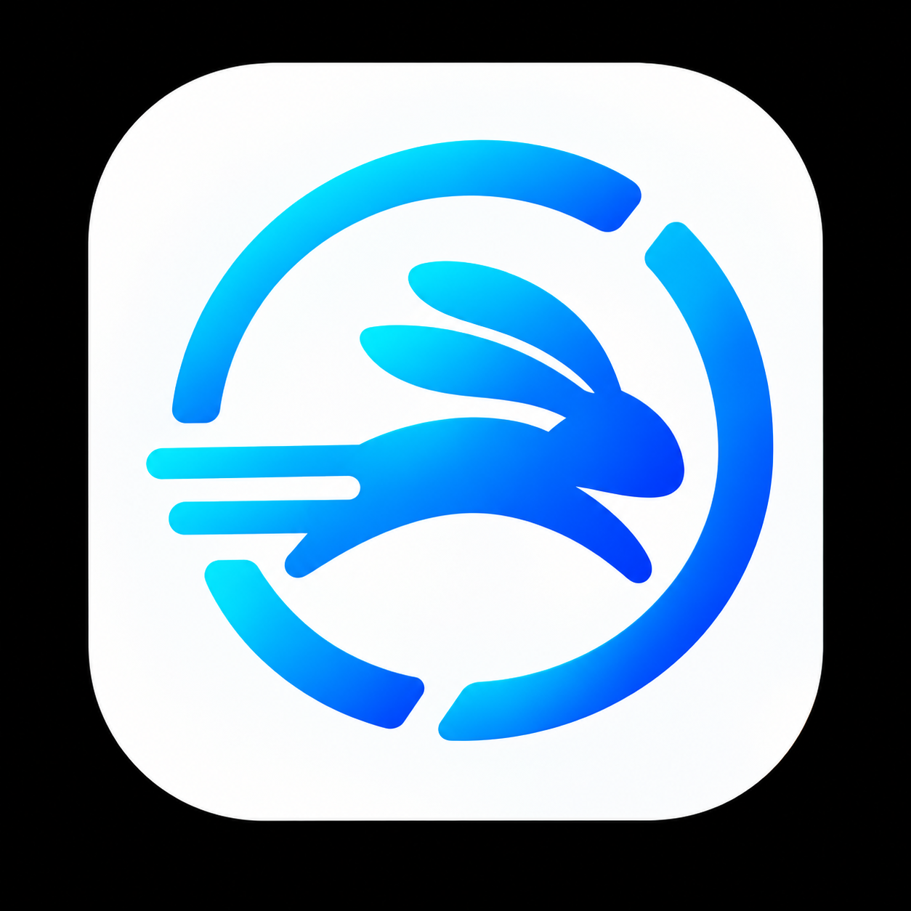

<p align="center">
  
</p>

# RustDeskHop — RustDesk Network Companion

RustDeskHop is a free, open-source, independent companion for RustDesk, licensed under [GNU GPLv3](LICENSE) (`GPL-3.0-only`). It is not affiliated with or endorsed by the RustDesk project.

RustDesk is excellent at connecting to devices, but it becomes awkward when one operator regularly uses more than one RustDesk network—for example, RustDesk's public network and a private self-hosted server.

This companion app provides a simple client-and-network launcher:

- Save named RustDesk network profiles.
- Associate each client with the network where its ID exists.
- Route each new connection through its assigned network, even when RustDesk's default is different.
- Keep existing RustDesk sessions open while connecting through another server.
- Confirm the route in a clear popup when it differs from RustDesk's default.
- Check private-server reachability before launching the connection.
- Detect an existing RustDesk account login and continue automatically.
- Guide the one-time public-server sign-in and resume the pending connection afterwards.

Normal connections use RustDesk's per-connection server syntax and do not rewrite its global configuration. The companion does not replace RustDesk, enter Google/Microsoft/GitHub credentials, or force-kill the RustDesk background service. Private profiles still require a working VPN or other route to the private server.

## The problem this solves

Without a network-aware launcher, users have to remember which server owns a RustDesk ID and manually change RustDesk's network settings. That can cause confusing “ID not found” errors and can interrupt existing sessions.

The intended workflow is:

1. Select a saved client.
2. The companion identifies the required network.
3. If it differs from the current RustDesk default, a confirmation explains that only the new connection is being routed differently.
4. Existing sessions remain connected.
5. The companion checks private-network reachability and opens the connection.

After the one-time RustDesk public-account setup, this is a single selection and confirmation. If public sign-in has never been completed, RustDeskHop can prepare the public profile with Windows administrator approval, open RustDesk, wait for the user to finish the browser login, and then continue the original connection automatically. Backups of any RustDesk configuration touched by this recovery flow are kept in a `RustDeskHop Backups` folder beside the original configuration.

## How to use RustDeskHop

For normal day-to-day use:

1. Open **RustDeskHop**.
2. Select the computer you want to reach.
3. Check that the displayed network is the one you expect.
4. Click **Connect** (or press Enter while the computer list is focused).
5. Approve the route confirmation if one appears.

That is the complete switching workflow. RustDeskHop routes the new connection through the network assigned to that computer. You do not need to edit RustDesk's server settings, restart RustDesk, or manually switch between public and private servers. Existing sessions on other networks stay open.

### One-time setup

Before the first connection from a particular PC:

- Install and start RustDesk.
- Sign in to RustDesk's public service when that PC will initiate public connections. RustDesk supports providers such as Google and GitHub.
- Enter the remote computer's password on the first connection and let RustDesk remember it if appropriate for that device.
- Start Tailscale, another VPN, or the required network route before using a private profile.
- Make sure the destination computer and its RustDesk server are online.

After those one-time steps, future connections should require only selecting the computer and clicking **Connect**.

### The desktop interface

The light interface uses a rounded computer list, a pale-blue selection, and distinct Public/Private badges. The selected computer and its route appear beside **Connect**. Use **Add computer**, **Remove computer**, and **Manage networks** to maintain your saved connections. Arrow keys move through the computer list; Enter connects. Longer names wrap and longer lists scroll.

The rabbit icon stays in the title bar and taskbar, without a second oversized logo in the content. Network settings and the add-computer dialog share the same styling. These presentation changes do not change RustDesk routing or close existing sessions.

### Incoming connections to this PC

RustDeskHop controls the route used by **new outgoing connections**. It does not change this PC's incoming/default RustDesk registration during normal use. This means the PC can remain available through RustDesk's public service while it opens a separate connection through a private server.

For reliable unattended incoming access, keep the RustDesk background service installed and running, configure a permanent password, and give the connecting user this PC's RustDesk ID. The controlling computer must be signed in when RustDesk's public service requires it. RustDeskHop does not store remote-desktop passwords or account credentials.

### Troubleshooting

- **Public connection asks for login:** complete RustDesk's browser sign-in once, then retry from RustDeskHop.
- **Private server is unreachable:** confirm the required VPN or Tailscale connection is active and the server is online.
- **Password prompt appears:** enter the remote computer's password and choose RustDesk's remember option if desired.
- **Wrong network is shown:** use **Manage networks** or edit the saved client assignment before connecting.

## Configuration

On first run, use **Manage networks** and **Add computer** to configure the profiles and IDs for your environment. Settings are stored in:

```text
%APPDATA%\SimultriaRustDeskCompanion\settings.json
```

The public repository intentionally contains only generic defaults. A developer-specific `settings.local.json` may be placed beside the project file; it is ignored by Git and copied to the build output for local development.

## Build

```powershell
dotnet build RustDeskCompanion.csproj -c Release
dotnet test tests\RustDeskHop.Tests\RustDeskHop.Tests.csproj -c Release
```

The executable is produced under `bin\Release\net9.0-windows\`.

### Application icon

The approved rabbit artwork is used by the executable, taskbar, all application windows, and this README. The PNG and multi-resolution Windows ICO live in `Assets/` and are embedded in the application, so the standalone EXE does not need external image files. Download ZIPs also include the assets for shortcuts and other integrations.

`Assets/RustDeskHop.source.png` preserves the approved original; `Assets/RustDeskHop.png` is the transparent-background production version.

To rebuild the ICO after updating the PNG, run `powershell -File tools\Build-ApplicationIcon.ps1` on Windows. For existing Windows shortcuts, use the updated `RustDeskHop.exe` (icon index 0) or `Assets\RustDeskHop.ico` as the icon source. RustDesk itself retains its own icon.

## Branches and automation

- `develop` is the integration branch for ongoing work.
- `main` is the production branch.
- Pull requests targeting either branch run the Windows build check.
- Automated tests verify connection routing, RustDesk configuration detection, login detection, safe public-profile cleanup, and private-server probing.
- Every push to either branch produces a self-contained Windows ZIP artifact in GitHub Actions.

Because this is a desktop utility, the automated deployment target is a downloadable build artifact rather than a server. Version tags also publish permanent GitHub Releases, as described below.

Feature ideas can be submitted through the repository's **Feature request** issue template.

## Downloads

The latest public release is always available from the stable link below:

<https://github.com/Deucarian/rustdesk-network-companion/releases/latest>

Release files use versioned names such as `RustDeskHop-v0.1.0-win-x64.exe` and `RustDeskHop-v0.1.0-win-x64.zip`. Stable releases are created automatically when a version tag such as `v0.1.0` is pushed; tags such as `v0.1.0-beta.1` become prereleases.

New releases include `LICENSE` and a matching `RustDeskHop-v<version>-source.zip` alongside the Windows downloads. The Windows ZIP also includes the license and this usage guide. Download the source archive from the same release as your executable to inspect, modify, or rebuild that version; the **Build** section above describes the build commands.

## License

RustDeskHop's original code, documentation, and included original artwork are licensed under the **GNU General Public License, version 3 only** (`GPL-3.0-only`). See [LICENSE](LICENSE) for the full terms.

You may use, study, modify, and redistribute RustDeskHop. If you distribute modified versions, you must license those versions under GPLv3 and make the corresponding source code available to recipients under its terms. Private modifications do not have to be published. Commercial use and redistribution are permitted; the official RustDeskHop downloads are provided free of charge.

RustDeskHop is provided without warranty, including without any implied warranty of merchantability or fitness for a particular purpose, to the extent permitted by law.

RustDesk is a separate application, is not bundled here, and remains under [its own license](https://github.com/rustdesk/rustdesk/blob/master/LICENCE). Third-party dependencies retain their respective licenses. RustDesk's name and logo are not licensed by this repository, and RustDeskHop does not claim affiliation with or endorsement by RustDesk.
